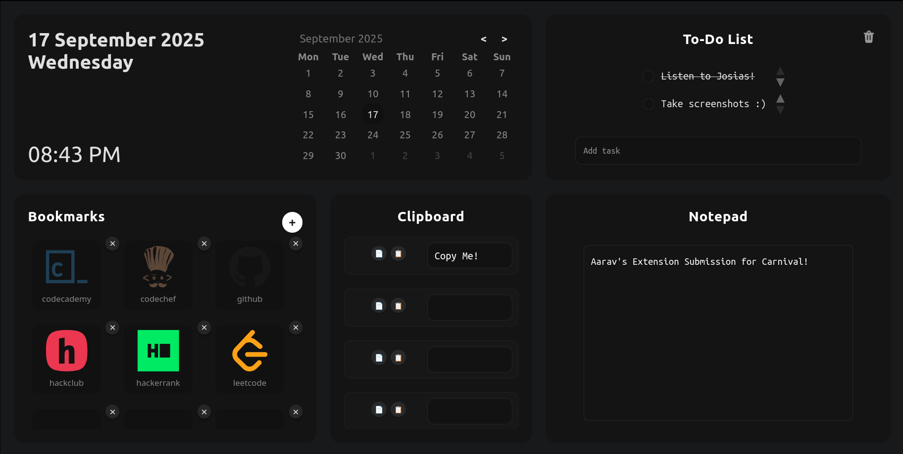

<h1 align="center">ProdTab — Minimal New Tab / Startpage</h1>

  

ProdTab is a lightweight, distraction‑free browser startpage that brings your daily tools together in a clean, dark, and minimal interface. It's designed for speed and privacy — everything runs completely in your browser and stores data locally using `localStorage`.

- Website: local static extension / startpage
- Tech: Vanilla HTML, CSS, and JavaScript
- Storage: Browser `localStorage` (no servers, no data leaves your device)

## What's included

- Calendar — view the current date and pick a date to copy it in multiple formats
- Todo list — simple task list with persistent storage
- Bookmarks — quick links grid with icons and edit/delete controls
- Clipboard — 5 small slots for frequently-used text snippets with per-slot copy/paste
- Notepad — a simple persistent notes area
- Minimal dark theme — distraction-free, low-contrast design

## Quick Start

1. Open `index.html` in a modern browser (Chrome, Firefox, Edge, Safari).
2. Allow clipboard access when prompted for copy/paste features to work.
3. Use the UI to add bookmarks, copy dates, save clipboard snippets, add todos, and take notes.

> Tip: For full experience (extensions, pinned new-tab), load the folder in a browser extension environment or serve the folder from a local web server.

## Features & Usage

### Bookmarks

- Click the `+` next to "Bookmarks" to open a modal and add a bookmark (name + URL).
- Bookmarks show a matching icon where available. Use the delete (`✕`) button or `Ctrl/Cmd + Click` on a tile to remove it.
- Click a bookmark tile (no modifier) to open its URL in the current tab.

### Clipboard

- Each of the 5 clipboard boxes has its own Copy and Paste buttons.
- Click Copy to place that box's content into your OS clipboard. Click Paste to insert clipboard contents into that box.

### Calendar

- Click any date to open a small modal where you can choose a date format (MM/DD/YYYY, DD/MM/YYYY, YYYY-MM-DD, Mon DD, YYYY).
- Click a format to copy the selected date to the clipboard.

### Todo List

- Add tasks using the input and press Enter.
- Mark tasks complete with the checkbox; use the clear completed button to remove finished items.

### Notepad

- Free-form notes stored locally. Use it for snippets, quick drafts, or journaling.

## Development

This project is intentionally dependency-free.

- Files of interest:
  - `index.html` — layout and markup
  - `assets/styles.css` — UI styles
  - `assets/script.js` — application logic and storage
  - `assets/icons/` — stored icons used for bookmarks

## Testing Checklist

- Add a bookmark and verify modal closes and tile appears
- Delete a bookmark via the ✕ button and via Ctrl/Cmd + Click
- Use each clipboard slot's Copy button and confirm clipboard contents
- Click a calendar date and copy a format to clipboard
- Add todos, complete them, and clear completed
- Type in Notepad and refresh the page to ensure persistence

## Contributing

- This project is minimalist and small — pull requests are welcome for bug fixes and small UX improvements.
- Please open issues for larger feature requests so we can discuss scope.

## License

This project uses the LICENSE included in the repository.

---
